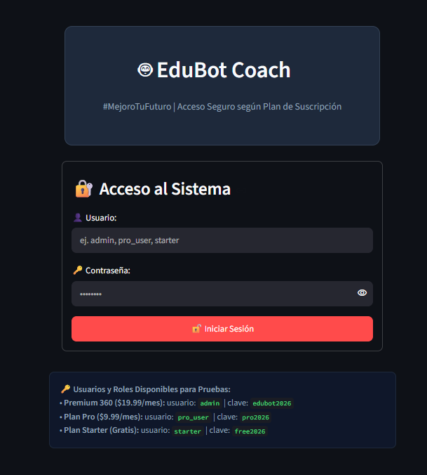
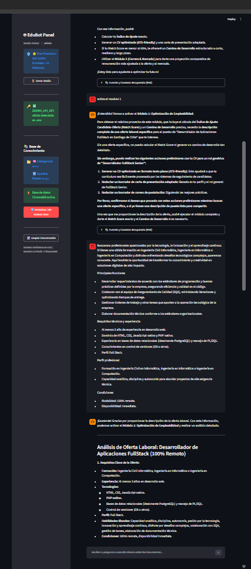
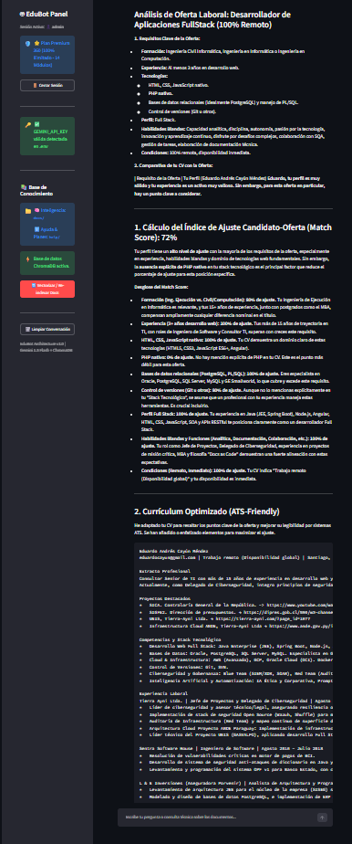
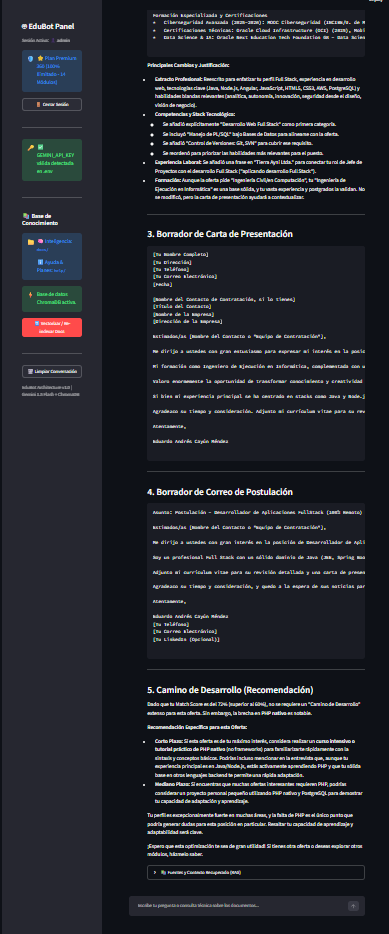

# 🤖 EduBot Coach #MejoroTuFuturo - Agente RAG Profesional

**EduBot Coach** es una solución RAG (Retrieval-Augmented Generation) de asistencia técnica, desarrollo profesional y consultoría integral. Actúa como un mentor experto enfocado en empleabilidad, decisiones estratégicas, salud, calidad de vida y proyección financiera a través de **14 módulos de análisis especializados**.

---

### 🌐 Aplicación Desplegada en Producción (AWS EC2)

La aplicación se encuentra activa y desplegada en vivo en la infraestructura de **AWS (EC2)**:

👉 **[https://ec2-56-124-13-24.sa-east-1.compute.amazonaws.com/](https://ec2-56-124-13-24.sa-east-1.compute.amazonaws.com/)**  
*(O vía HTTP en: [http://ec2-56-124-13-24.sa-east-1.compute.amazonaws.com/](http://ec2-56-124-13-24.sa-east-1.compute.amazonaws.com/))*

#### 📸 Capturas de Pantalla de la Aplicación en Vivo






---

## 🌟 Características Principales

- **🤖 Motor Generativo con Google Gemini 2.5 Flash:** Orquestación mediante LangChain con el modelo `gemini-2.5-flash` para respuestas rápidas, precisas y fundamentadas en fuentes.
- **⚡ Embeddings y Persistencia Vectorial ChromaDB:** Vectorización con `models/gemini-embedding-001` y almacenamiento local persistente en el directorio `chroma_db/`.
- **🛡️ Inserción por Lotes & Resiliencia a Rate Limits:** Sistema de carga por lotes (*batching*) con control de tiempos para evitar exceder las cuotas gratuitas de la API de Gemini (Error 429).
- **📂 Doble Fuente de Conocimiento (`docs/` e `help/`):**
  - **`docs/` (Inteligencia e Informes):** PDFs y documentos técnicos sobre empleabilidad, salud, finanzas y dinámicas de trabajo.
  - **`help/` (Soporte y Producto):** Base de conocimiento oficial, preguntas frecuentes (FAQ), términos de uso, políticas y tabla de planes.
- **📄 Adjunto Directo de CV en PDF desde el Chat:** El usuario puede adjuntar su Currículum Vitae en PDF desde el botón de la interfaz del chat; el sistema extrae el texto mediante `pypdf` e inyecta su perfil en el contexto para evaluación ATS y plan de carrera.
- **🔐 Autenticación de Usuario & Control de Roles por Plan:** Inicio de sesión seguro con control de acceso basado en roles (RBAC) y badges visuales según la suscripción del usuario.

---

## 📊 Sistema de Roles y Planes de Suscripción

| Plan / Rol | Precio | Módulos Desbloqueados | Credenciales de Prueba |
| :--- | :---: | :--- | :--- |
| **🌱 Starter (Gratis)** | **$0/mes** | • **Módulo 1:** Optimización CV & Match Score (Límite 3/mes)<br>• **Módulo 2:** Visión Estratégica y Proyección Salarial | **Usuario:** `starter`<br>**Clave:** `free2026` |
| **🚀 Pro** | **$9.99/mes** | • **Módulos 1 al 9:** Empleabilidad ilimitada, Networking, Benchmark Internacional, Radar Laboral, Finanzas & Futuro, Gamificación.<br>• **Módulo 14:** Simulador Emprendimiento vs Empleo (Limitado).<br>• **Reportes PDF:** Descargables. | **Usuario:** `pro_user`<br>**Clave:** `pro2026` |
| **⭐ Premium 360** | **$19.99/mes** | • **Acceso Total Ilimitado a los 14 Módulos** (Empleabilidad, Finanzas, Nutrición, Ejercicios, Cohesión Familiar, Inversiones Avanzadas, Autoemprendimiento y Simulador 360). | **Usuario:** `admin`<br>**Clave:** `edubot2026` |

---

## 📐 Estructura del Proyecto

```
CHALLENGE_ALLURAONE_AI2026/
├── docs/                      # Documentos de análisis e inteligencia (.pdf, .txt)
├── help/                      # Base de conocimiento oficial, FAQ, Planes y Políticas (.md)
├── imagenes_entrega/          # Capturas de pantalla de la aplicación activa
├── chroma_db/                 # Almacenamiento persistente de ChromaDB (auto-generado)
├── .env.example               # Plantilla de variables de entorno
├── .env                       # Variables de entorno locales (API Key y usuarios)
├── .gitignore                 # Exclusión de entornos virtuales, caché y base vectorial
├── requirements.txt           # Dependencias exactas de Python
├── email_engine.py            # Módulo de conexión e inspección de correo vía IMAP SSL
├── rag_engine.py              # Motor RAG con Gemini 2.5 Flash, ChromaDB y Lotes
├── app.py                     # Interfaz Web interactiva en Streamlit con Auth y CV uploader
├── Dockerfile                 # Configuración de la imagen Docker (python:3.10-slim)
└── docker-compose.yml         # Orquestación con volumen persistente en chroma_db
```

---

## 🛠️ Guía de Instalación Paso a Paso

### 1️⃣ Instalación Local (Desarrollo)

Sigue estos pasos para instalar y ejecutar EduBot Coach localmente en tu computadora:

#### Paso 1.1: Clonar el repositorio
```bash
git clone https://github.com/educhile1/CHALLENGE_ALLURAONE_AI2026.git
cd CHALLENGE_ALLURAONE_AI2026
```

#### Paso 1.2: Crear y activar un entorno virtual de Python
```bash
# En Windows:
python -m venv venv
.\venv\Scripts\activate

# En Linux / macOS:
python3 -m venv venv
source venv/bin/activate
```

#### Paso 1.3: Instalar las dependencias de Python
```bash
pip install -r requirements.txt
```

#### Paso 1.4: Configurar el archivo de variables de entorno `.env`
Copia el archivo `.env.example` y renómbralo a `.env`:
```bash
cp .env.example .env
```
Edita `.env` con un editor de texto e ingresa tu `GEMINI_API_KEY` (puedes obtener una gratuita en [Google AI Studio](https://aistudio.google.com/app/apikey)):
```env
GEMINI_API_KEY=tu_google_gemini_api_key_real
CHROMA_PERSIST_DIR=chroma_db
DOCS_DIR=docs
DOCS_HELP=help

ADMIN_USER=admin
ADMIN_PASS=edubot2026
PRO_USER=pro_user
PRO_PASS=pro2026
STARTER_USER=starter
STARTER_PASS=free2026
```

#### Paso 1.5: Ejecutar la aplicación
```bash
streamlit run app.py
```
Abre tu navegador en **`http://localhost:8501`** (o en **`http://localhost`** si se ejecuta en puerto 80).

---

### 2️⃣ Despliegue Paso a Paso en AWS EC2 (Con Docker Compose en Puerto 80)

Si deseas desplegar la aplicación en tu propia instancia de **AWS EC2**:

#### Paso 2.1: Conectarte a tu servidor EC2 por SSH
```bash
ssh -i "tu-clave-aws.pem" ubuntu@tu-ip-publica-ec2
```

#### Paso 2.2: Instalar Docker, Docker Compose y Git en la EC2
```bash
sudo apt update && sudo apt upgrade -y
sudo apt install -y docker.io docker-compose-plugin git
sudo systemctl start docker
sudo systemctl enable docker
sudo usermod -aG docker $USER
newgrp docker
```

#### Paso 2.3: Habilitar el Puerto 80 en el Security Group de AWS
Ve a la Consola de AWS -> Instancias EC2 -> Security Groups -> Editar Reglas de Entrada (Inbound Rules) y agrega:
- **Tipo:** HTTP (Puerto 80)
- **Origen:** `0.0.0.0/0` (Cualquier lugar)

#### Paso 2.4: Clonar el proyecto en la EC2
```bash
git clone https://github.com/educhile1/CHALLENGE_ALLURAONE_AI2026.git
cd CHALLENGE_ALLURAONE_AI2026
```

#### Paso 2.5: Crear el archivo `.env` en la EC2
```bash
nano .env
```
Pega tu configuración y clave de API Gemini, luego guarda con `Ctrl+O` y `Enter`, y sal con `Ctrl+X`.

#### Paso 2.6: Desplegar la aplicación con Docker Compose
```bash
docker compose up --build -d
```

#### Paso 2.7: Acceso en Producción
Visita tu aplicación en la URL de tu instancia EC2:
👉 **[https://ec2-56-124-13-24.sa-east-1.compute.amazonaws.com/](https://ec2-56-124-13-24.sa-east-1.compute.amazonaws.com/)**

---

## 📄 Licencia y Autores

Desarrollado por **Eduardo Cayún M.** para el **Challenge de ONE Alura Latam**. Todos los derechos reservados.